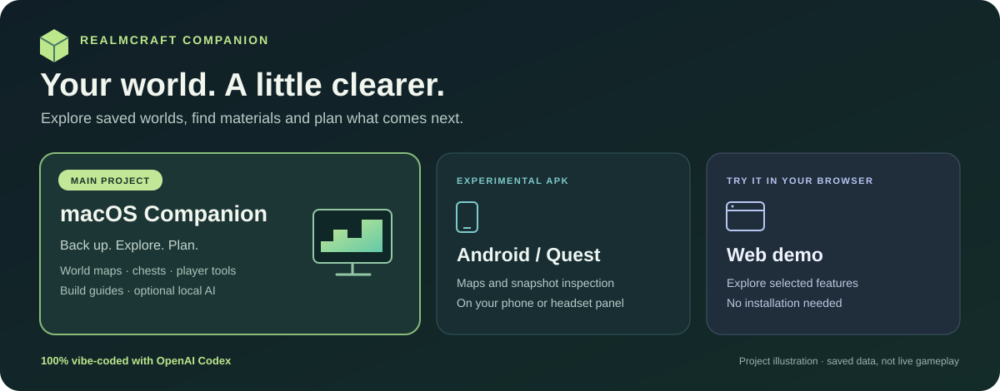
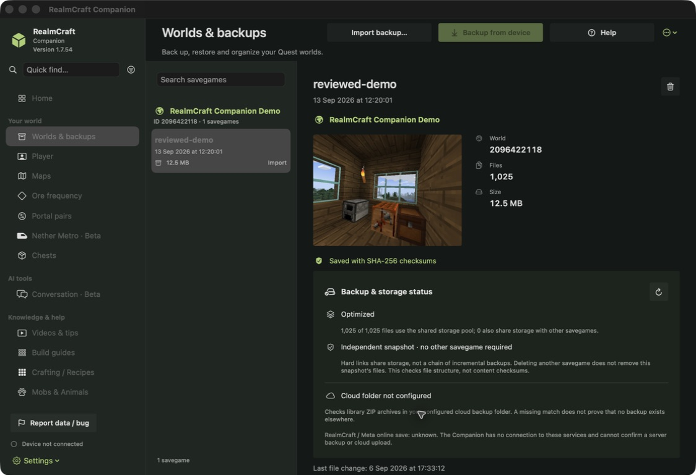
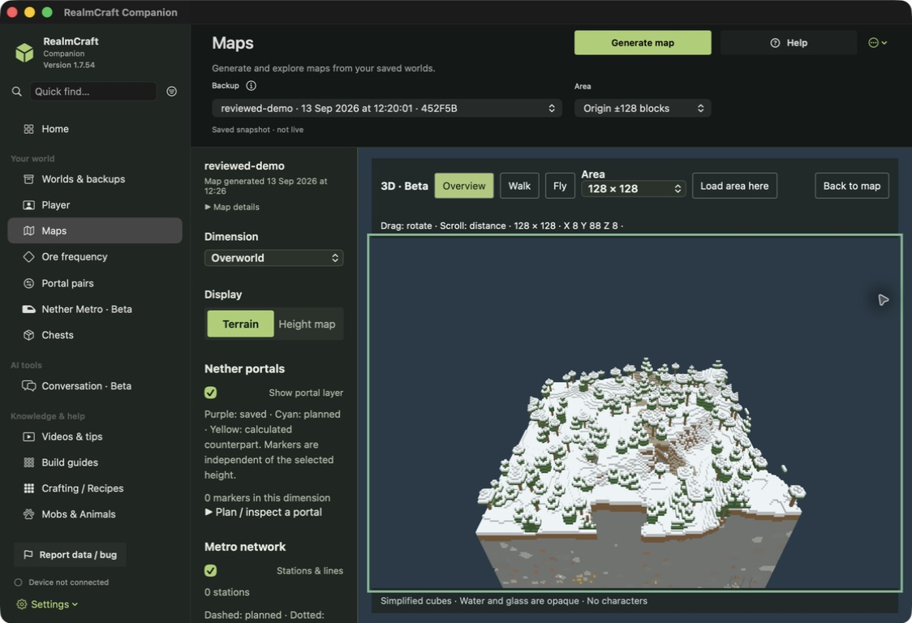
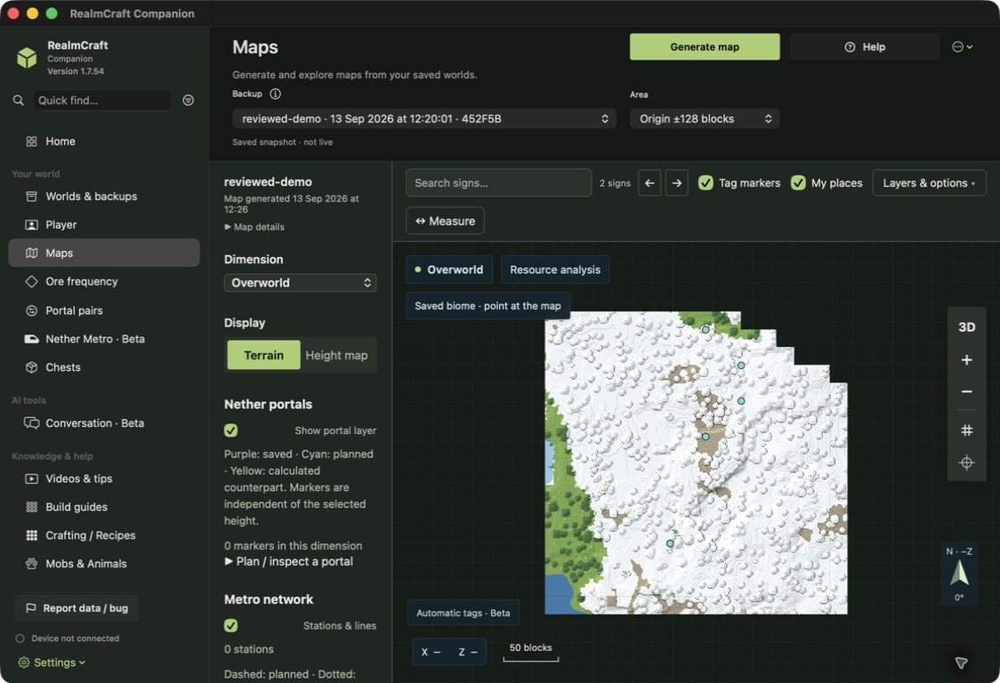

# RealmCraft Companion

**Explore your saved world. Find your materials. Plan your next build.**

**100% vibe-coded with OpenAI Codex · 100 % mit OpenAI Codex entwickelt.**

AI contributor: **[Codex Astra](CONTRIBUTORS.md)**

[RealmCraft Companion Wiki](https://github.com/friedensbringer-peacemaker/RealmCraft-Companion/wiki) · [Screenshot gallery · 1.7.54](docs/GALLERY.md)



<p align="center">
  <a href="https://friedensbringer-peacemaker.github.io/RealmCraft-Companion/"><strong>▶ Try the website</strong></a> &nbsp; · &nbsp;
  <a href="https://github.com/friedensbringer-peacemaker/RealmCraft-Companion-Android/releases/latest"><strong>↓ Android / Quest APK</strong></a> &nbsp; · &nbsp;
  <a href="https://github.com/friedensbringer-peacemaker/RealmCraft-Companion/releases/latest"><strong>⌘ Download the macOS app</strong></a>
</p>

An independent community toolkit for **RealmCraft VR on Meta Quest**. The macOS Companion is the main project and reference for features and design. Android/Quest and the website provide their own smaller, platform-specific experiences. Views use saved snapshots rather than live gameplay.

**Deutsch:** Sichere deine Welt, erkunde ihre Karte, finde Gegenstände in Truhen und plane Bauvorhaben. Der macOS Companion ist das Hauptprojekt; APK und Website ergänzen es auf anderen Geräten.

## Three ways to explore

| ⌘ macOS Companion — **main project** | ◈ Android / Meta Quest | ◎ Website / browser demo |
| --- | --- | --- |
| Native SwiftUI desktop app for managing and exploring saved worlds. | Experimental Android app for phones and a 2D panel on Quest. | Try selected Companion features directly in a browser. |
| Backup and restore, maps, chest search, player tools, build guides and optional local AI. | Import and inspect copies, browse maps and items, compare snapshots and plan material collection. | Interactive maps, chest search, inventory sandbox, guides, recipes and context export. |
| **macOS 14+ · Apple Silicon & Intel** | **Experimental APK · sideloading** | **No installation · English / Deutsch** |
| [App documentation](RealmCraftCompanion/README.md) · [Source](RealmCraftCompanion) | [Android project](https://github.com/friedensbringer-peacemaker/RealmCraft-Companion-Android) · [Download APK](https://github.com/friedensbringer-peacemaker/RealmCraft-Companion-Android/releases/latest) | [Open website](https://friedensbringer-peacemaker.github.io/RealmCraft-Companion/) · [Web project](RealmCraftWebDemo/README.md) |

> **Choose the right version:** macOS provides the broadest toolset. The Android app works with separate snapshots and does not edit or restore RealmCraft game files. Browser inventory edits are a sandbox; they do not create a playable edited savegame. The three editions do not have full feature parity.

## See the Companion in action

Real captures of **macOS Companion 1.7.54 (76)**, using the approved **RealmCraft Companion Demo** snapshot saved on 6 September 2026. The overview includes the demo house; maps and 3D show saved terrain. Click an image for its full size.

| Demo world and library | 3D renderer · Beta |
| --- | --- |
| [](docs/screenshots/v1.7.54/demo-library.png) | [](docs/screenshots/v1.7.54/demo-three-dimensional.png) |
| **Saved world map** | **Help topics** |
| [](docs/screenshots/v1.7.54/demo-map.png) | [RealmCraft Companion Wiki](https://github.com/friedensbringer-peacemaker/RealmCraft-Companion/wiki) |

**[Screenshot gallery →](docs/GALLERY.md)** · **[Route planning, AI export and turn-by-turn examples →](docs/AGENT-AND-NAVIGATION-EXAMPLES.md)**

Use the map to compare route candidates, export inventory and storage as Markdown or JSON, and pass optional navigation steps with nearby POIs to an agent. Navigation uses saved surface data and requires in-game checks; it does not track your live position.

## What can I do with it?

| Your question | In the macOS Companion |
| --- | --- |
| **“How do I keep a backup before trying something?”** | Save and verify world copies, organize the library and restore through the guarded transfer workflow. |
| **“Where did I put that material?”** | Read chest contents, search items and quantities, and locate saved containers on a map. |
| **“What is in my world?”** | Explore saved terrain, interesting places and map layers. Unrecorded areas remain unknown. |
| **“What am I carrying?”** | Inspect saved inventory, armor, enchantments and supported durability values. |
| **“What should I build next?”** | Browse illustrated build guides, reference recipes and material lists; evidence and game-compatibility limits stay visible. |
| **“Can I discuss this with an AI?”** | Export a world context or use the optional local conversation tools. Core backup and inspection features do not require an AI account. |

### A simple first visit

1. **[Open the website](https://friedensbringer-peacemaker.github.io/RealmCraft-Companion/)** to explore the reviewed public demonstration world without installing an app.
2. Try the **map**, search **chests**, inspect **inventory**, then browse a **build guide**.
3. Choose the **macOS project** for the full desktop workflow, or the **[experimental APK](https://github.com/friedensbringer-peacemaker/RealmCraft-Companion-Android/releases/latest)** to inspect snapshots on Android/Quest.

The shared demo is a separately reviewed download, not a collection of private saves. The website can also read supported ZIP files locally in the browser. See the [web documentation](RealmCraftWebDemo/README.md) and [Android instructions](https://github.com/friedensbringer-peacemaker/RealmCraft-Companion-Android#downloadable-demo) for format and device limits.

## Download or build the macOS Companion

The current desktop release is **1.7.49**. [Download the universal macOS app and checksums](https://github.com/friedensbringer-peacemaker/RealmCraft-Companion/releases/tag/v1.7.49). It supports Apple Silicon and Intel on macOS 14+. This community build is ad-hoc signed and is not Apple-notarized.

The release brings the latest native UI, interactive 2D/3D build plans, visible sign labels, navigation clipboard/iCloud export and longer spoken route sections, with refreshed German/English help. Screenshots below retain their original 1.7.26 capture labels.

To build from source:

Install Xcode Command Line Tools and Python 3 on macOS, then run:

```sh
cd RealmCraftCompanion
./build.sh
```

The script targets macOS 14+ on Apple Silicon and Intel and creates `RealmCraft Companion.app` beside the project directory. The build is ad-hoc signed; the downloadable community release is not notarized. Optional maps and local models have their own setup instructions in the [app guide](RealmCraftCompanion/README.md).

## Find your way around the source

| Directory / project | Purpose |
| --- | --- |
| [`RealmCraftCompanion/`](RealmCraftCompanion) | **Main application:** SwiftUI sources, resources, synthetic tests and offline help. |
| [`RealmCraftWebDemo/`](RealmCraftWebDemo) | The static web edition published on [GitHub Pages](https://friedensbringer-peacemaker.github.io/RealmCraft-Companion/). |
| [Android repository](https://github.com/friedensbringer-peacemaker/RealmCraft-Companion-Android) | Separate Android/Quest source, build instructions, APK releases and device guidance. |
| [`SavegameLibrary/`](SavegameLibrary) | Earlier standalone library project, retained as development history. |
| [`RealmcraftMap/`](RealmcraftMap) | Standalone Python map-rendering project. |

**Development:** [Change log](RealmCraftCompanion/Resources/CHANGELOG.md) · [Backlog](RealmCraftCompanion/Resources/BACKLOG.md) · [Contributing](CONTRIBUTING.md) · [Contributors](CONTRIBUTORS.md)

Earlier development is documented in the change log; it is not reconstructed as Git commit history. This project was developed entirely with OpenAI Codex. Contributions should preserve bilingual text, explicit compatibility limits and the backup safeguards.

## Privacy and project scope

Publish project files, generic documentation and synthetic tests only. Personal saves, private exports, device identifiers and personal paths must not be attached to issues, commits or releases. The explicitly approved demonstration world is a separate, reviewed exception. Browser-local ZIP opening does not upload a savegame.

The header graphic is a schematic project illustration. The screenshot gallery uses only the approved demo snapshot in a separate local library with device access disabled. No personal context is included.

## License and credits

Project code is MIT licensed; existing component notices are preserved. Resource provenance and separate artwork terms are documented in the [community guide](RealmCraftCompanion/COMMUNITY.md), [mob image notes](RealmCraftCompanion/Resources/MobImages/README.md), [player skin notes](RealmCraftCompanion/Resources/PLAYER-SKIN.md) and [web artwork credits](RealmCraftWebDemo/ICON-LICENSE.md).

RealmCraft Companion is an independent community project and is not affiliated with Tellurion Mobile or Meta.
