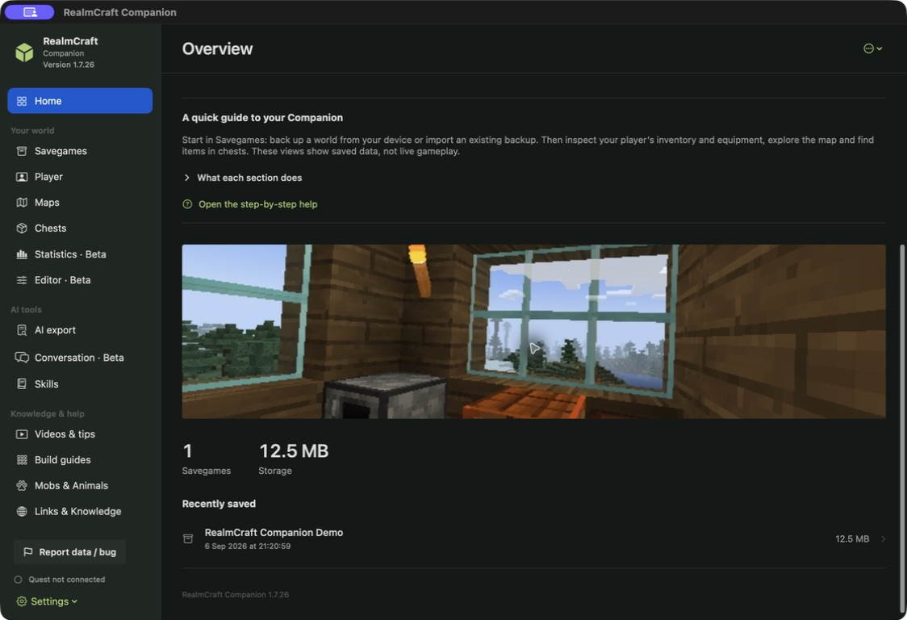
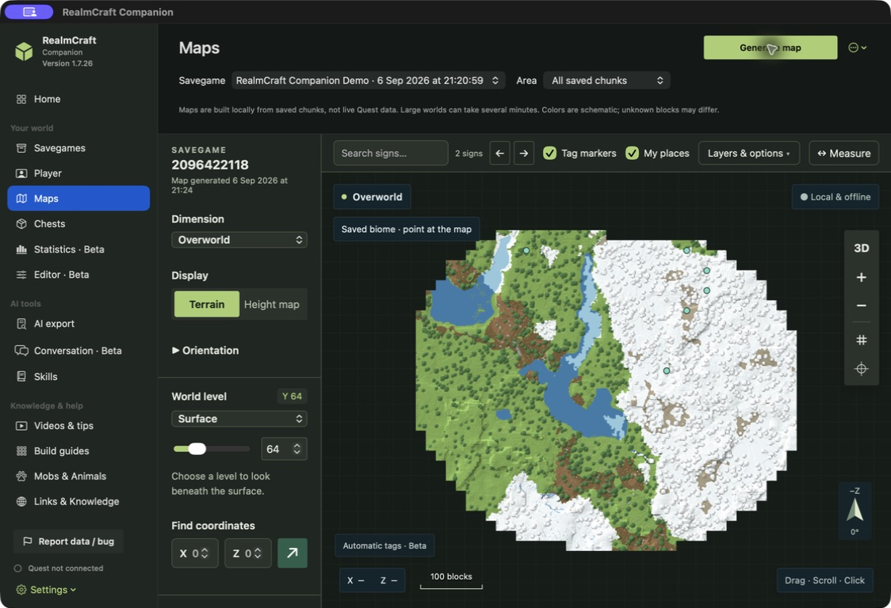
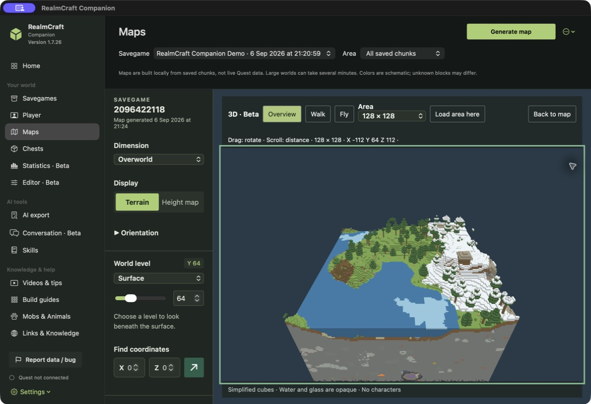
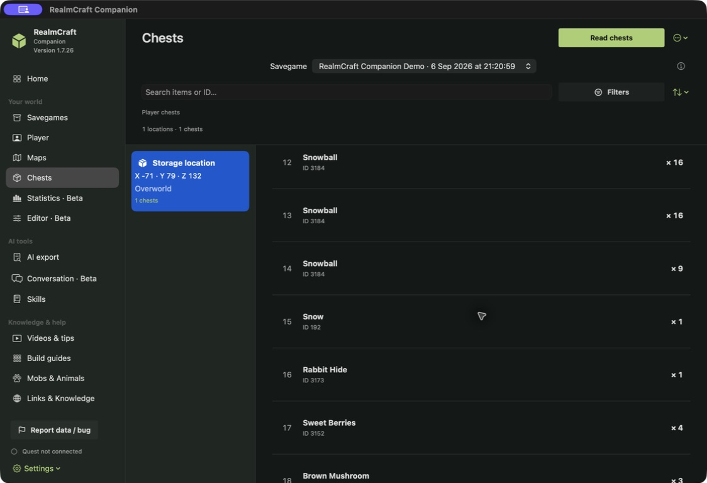
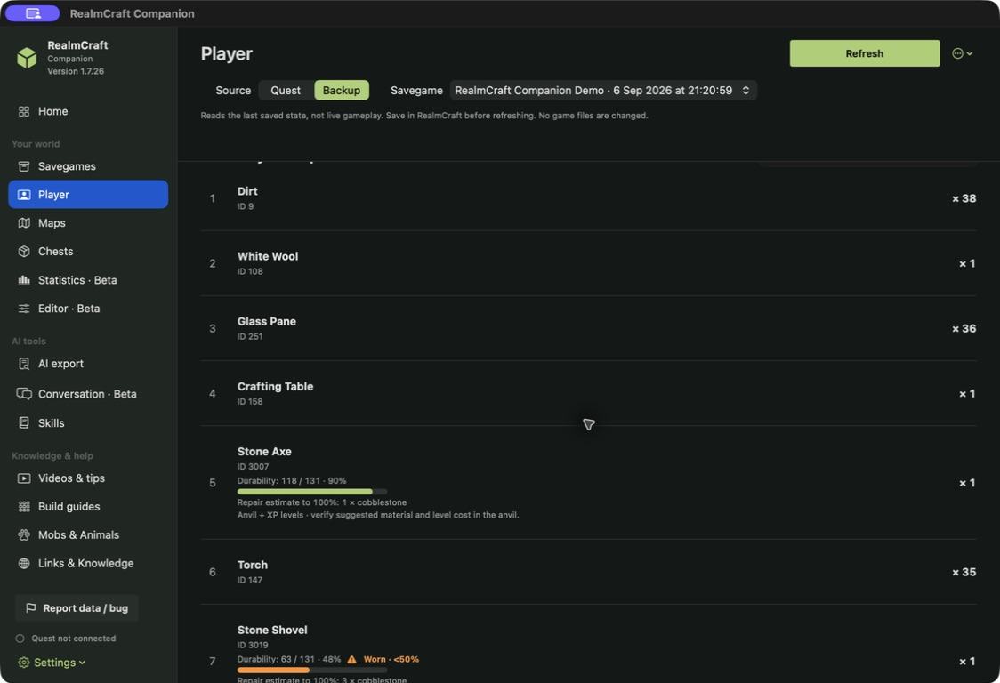
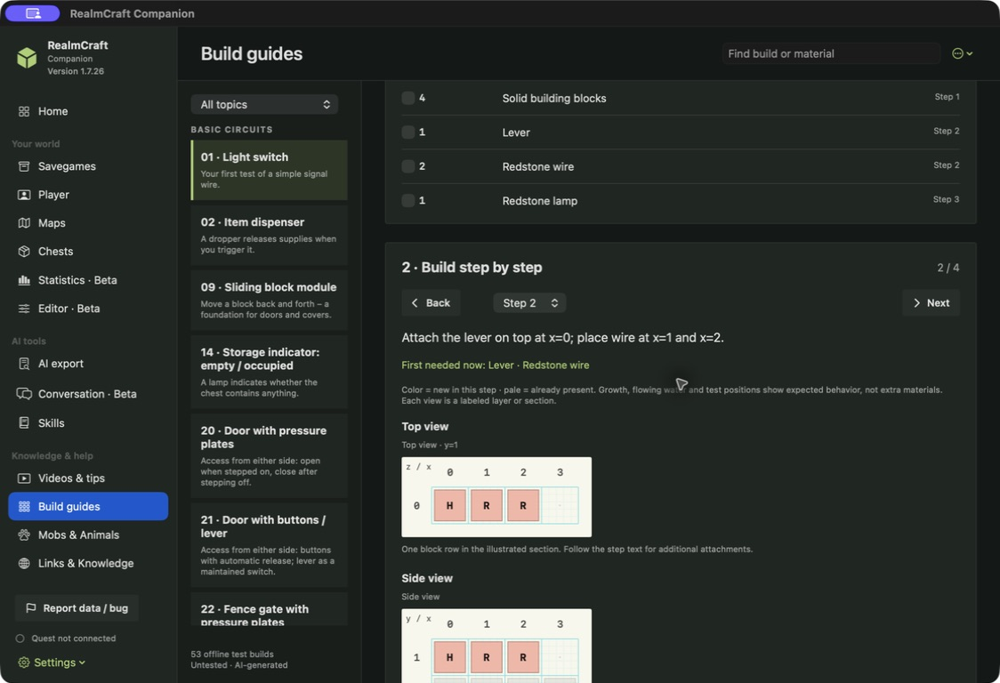

# Screenshot gallery · 1.7.54 (76)

Real app captures from an isolated profile using only the approved demo. Reference content and synthetic plans are labeled separately. Earlier version galleries are preserved.

This wiki follows the source version below. App downloads may be older; compare the release version. Screenshots are versioned individually.

## Demo library

The approved demo in an isolated library, with its saved house preview and backup status. No headset is connected.

## Saved world map

Terrain around the demo origin, with sign search, layer controls and planned portal and metro overlays. This is saved data, not live gameplay.

## 3D terrain preview · Beta

A 128 × 128 block area of the approved demo. Overview, Walk and Fly inspect simplified cubes; water and glass are opaque and characters are absent.

[RealmCraft Companion Wiki](https://github.com/friedensbringer-peacemaker/RealmCraft-Companion/wiki) · [Maintain the wiki and screenshots](https://github.com/friedensbringer-peacemaker/RealmCraft-Companion/wiki/Maintaining-the-wiki)

---

# Inside RealmCraft Companion

**100% vibe-coded with OpenAI Codex · 100 % mit OpenAI Codex entwickelt.** AI contributor: [Codex Astra](../CONTRIBUTORS.md).

[Main Companion project](../README.md) · [Android / Quest APK](https://github.com/friedensbringer-peacemaker/RealmCraft-Companion-Android) · [Website](https://friedensbringer-peacemaker.github.io/RealmCraft-Companion/)

These are real captures of **macOS Companion 1.7.26**, taken on **6 September 2026** in English. The approved **RealmCraft Companion Demo** snapshot was saved at **17:30 CEST** and imported for this gallery that evening. Screenshots show this newer snapshot; downloadable demo assets may have a different version. These macOS views do not imply Android or browser feature parity.

The capture library contains only the approved demo. Quest access was disabled in the capture app; no personal context was included. Visible world coordinates and identifiers belong exclusively to this demo. Original captures were visually reviewed and converted to PNG without descriptive metadata; no UI content was retouched. Exact publication hashes are recorded in [the publication checker](../tools/check_publication.py).

## 1. Start with your saved world

The overview brings the library, saved-world preview and main tools together. This demo now contains a small house and stored supplies. The house picture is the preview saved by the game, displayed inside the Companion; it is not a live camera feed.

## 2. Explore the map

The map covers all **1,020 saved chunks** of this snapshot. Terrain colors are schematic. Switch dimensions and height views, inspect markers, search saved signs or compare distances. The edge is the end of available saved terrain, not a claim that the game world ends there.

## 3. Look at the world in 3D · Beta

The 128 × 128 block preview makes the house, hills, water and terrain layers easier to understand. Overview, Walk and Fly provide different inspection controls. This is a simplified renderer: cubes are schematic, water and glass are opaque, and characters are absent.

## 4. Find stored materials

Select a storage location, then inspect its individual chest slots and quantities. This view uses the **player-chest filter** and shows one storage location. The full AI export scans all 30 discovered chests, including those outside that filter; unmarked containers are not automatically counted as owned supplies.

## 5. Check inventory and tool wear

The demo inventory contains building materials and tools. The stone axe has 118/131 durability remaining; the worn shovel has 63/131. These are values from the saved snapshot. Repair suggestions use supported reference data and must be checked in the game.

## 6. Follow a build guide

Material lists, individual steps and layer diagrams support small test builds. This capture shows the light-switch guide. The guide catalog explicitly labels these layouts **untested and AI-generated**; a displayed plan is not evidence that its mechanics have been verified in RealmCraft VR.

## 7. Give an agent useful context

The demo export was generated locally with **31 occupied inventory slots and 30 discovered chests**. Markdown and JSON represent the same snapshot; the preview is shorter than the saved document. Ownership, unsupported fields and missing values remain explicit. In this snapshot the player level is unavailable. Personal context was off, and no export was sent to an external agent during this capture.

Continue with [copyable agent prompts, a compact export excerpt, route comparisons and a turn-by-turn POI example](AGENT-AND-NAVIGATION-EXAMPLES.md).
